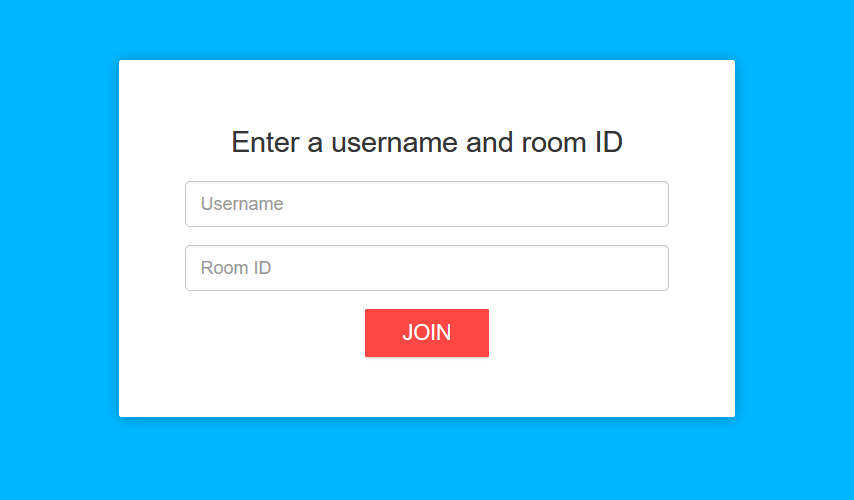
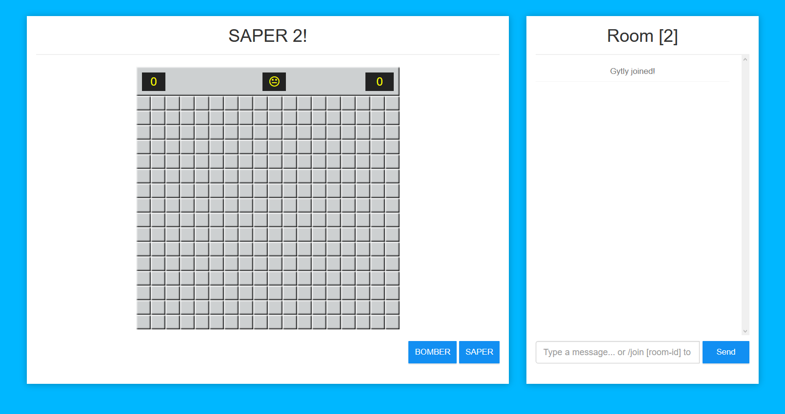
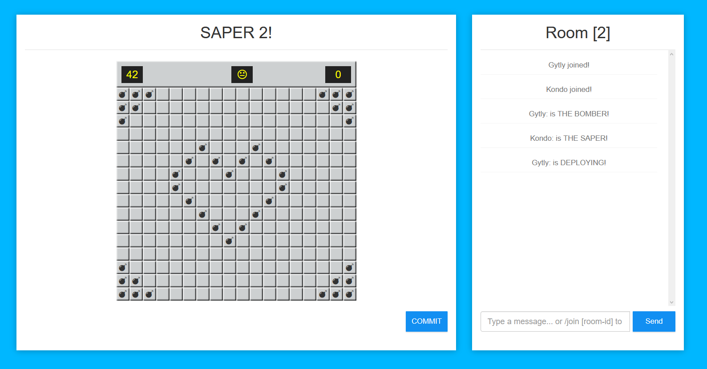
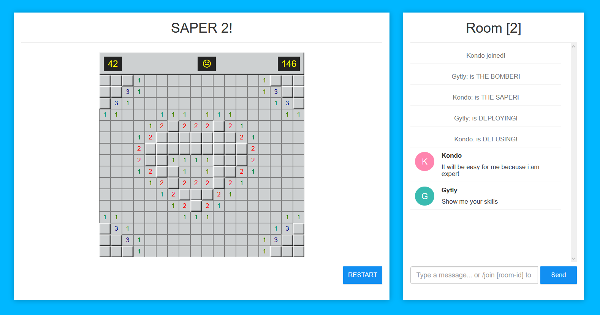
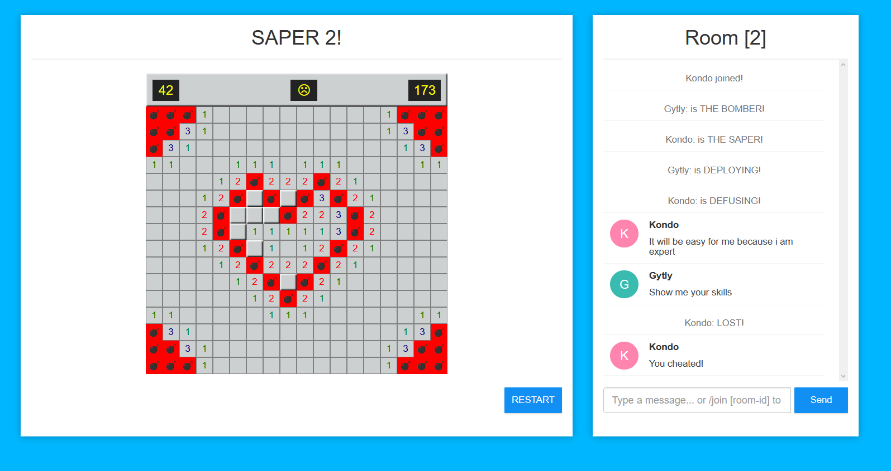

# Saper multiplayer 

Simple application in java and javascript

Technologies:
*  Spring boot
*  Spring websocket

# How to run this?
To start application:
`mvn spring-boot:run`

Test on http://localhost:8081
You can create two windows on your browser to test. 

# First stage

In this stage you can choose your name and room.

# Second stage #GAME

At first you have to choose your role, you can be a bomber, saper or if you don't want to play you will be an observer.

# DEPLOYING

Other players can't see where the bombs are deployed. But they can see how many boombs are being set in the current time.

# DEFUSING

Everyone can see what saper is doing.

# END

